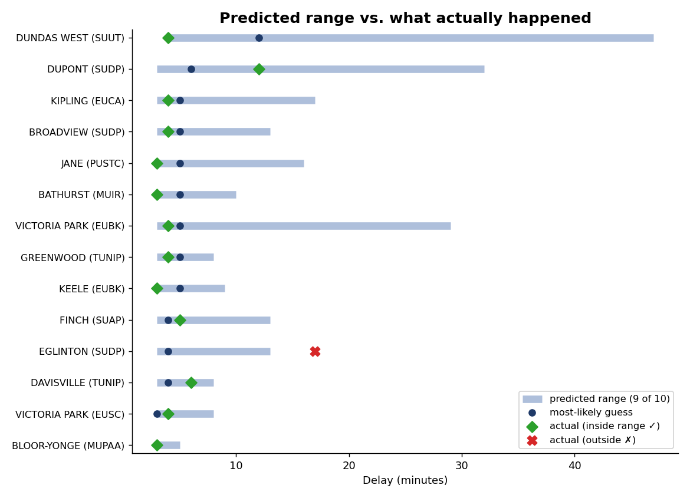
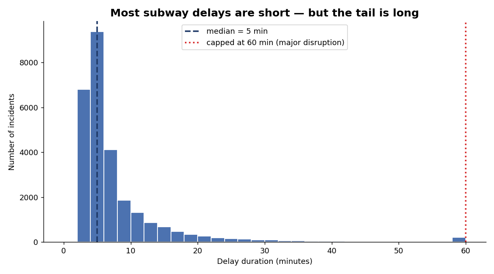
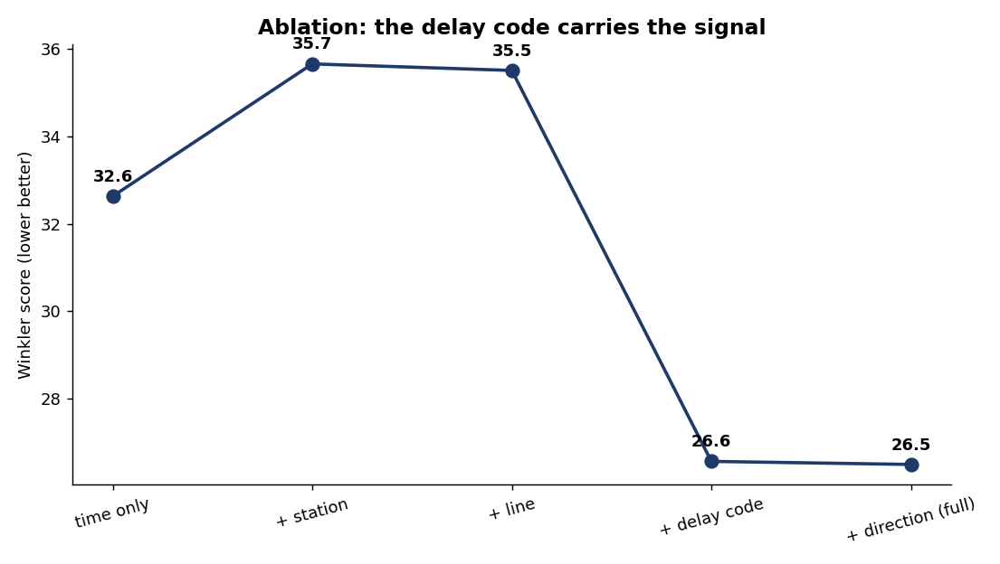
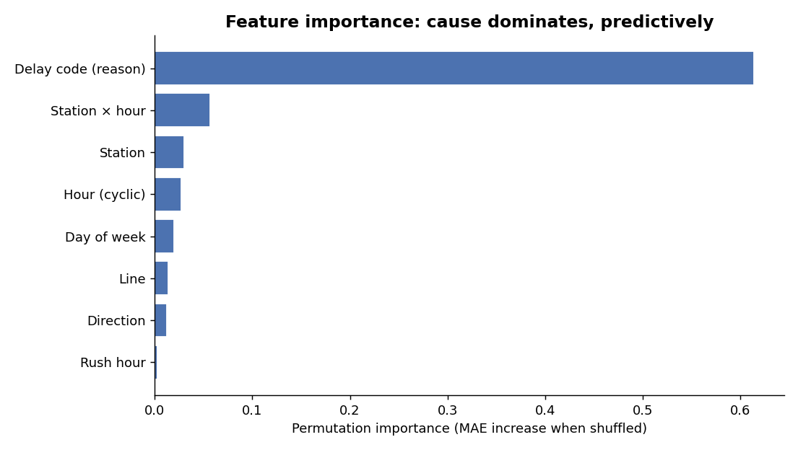
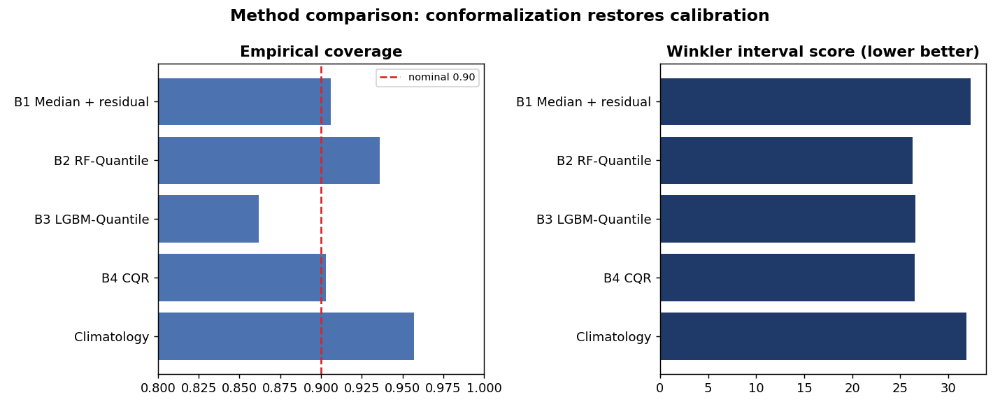
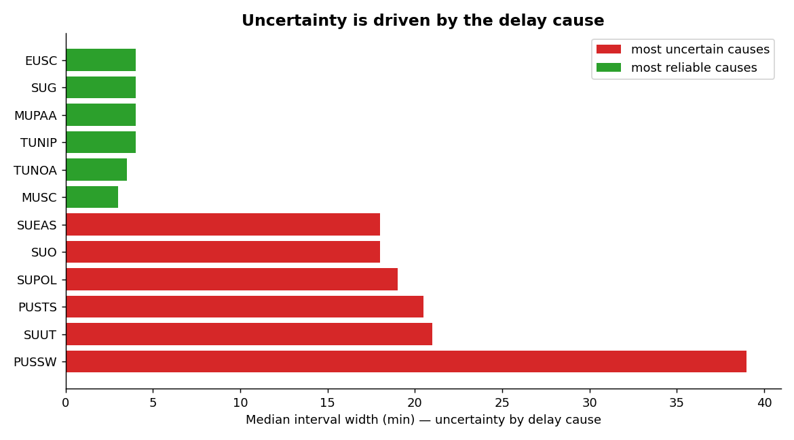
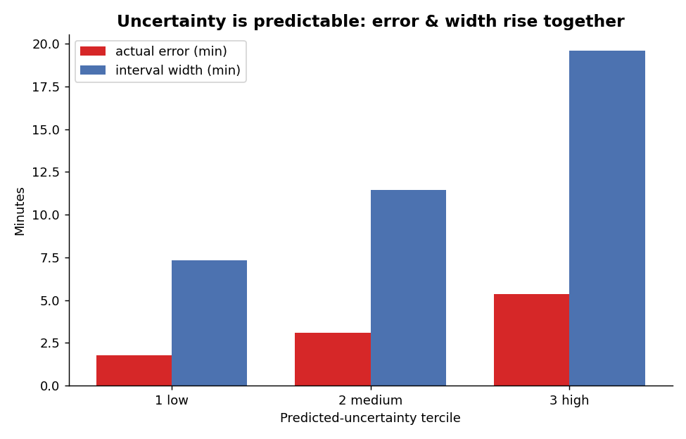
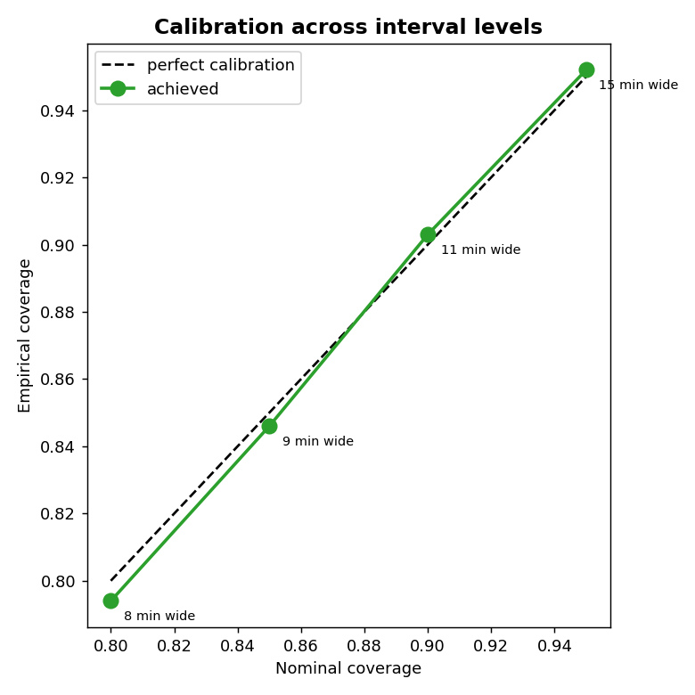
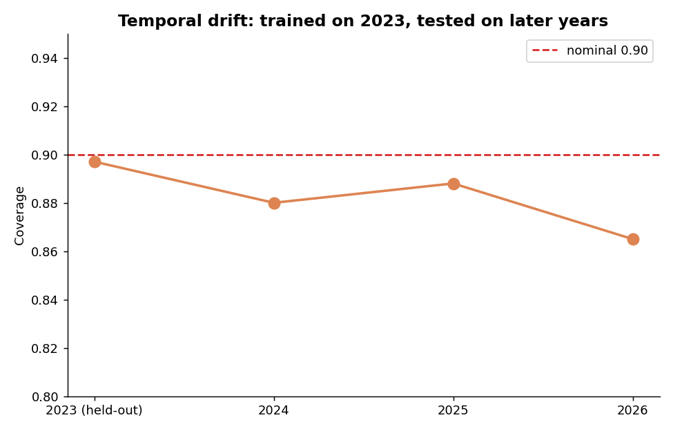

<h1 align="center">Predicting How Long a TTC Subway Delay Will Last</h1>

<p align="center">
  <i>It does not give one number. It gives a time range that is right about 9 times out of 10.</i>
</p>

<p align="center">
  <code>Python</code> , <code>LightGBM</code> , <code>Conformalized Quantile Regression</code> , 27,378 delays (2023 to 2026)
</p>

---

## Problem

Toronto subway delays happen a lot. When one happens, the rider has to make a fast choice: wait for
the train, or get out and find another way. To make that choice well, you need to know one thing,
how long the delay will be. But the TTC does not tell you. You just hear "we are experiencing
delays". That could mean 2 minutes or 40.

So riders just guess. If they wait and the delay is long, they are late. If they leave and it was
actually short, they took a slower route for nothing. A rough but honest time estimate would already
help a lot.

## What this project does

This project uses the TTC's own public delay data to give that estimate. For an incident it predicts
a time range for the delay, for example "most likely 8 minutes, probably between 3 and 20".

It gives a range and not a single number on purpose. The exact minutes cannot be known from this
data, so one number would be fake precision. The range is built so the real delay falls inside it
about 9 times out of 10. That is something a rider can actually use. A small range near zero means
wait, a wide or high range means leave.

<p align="center">
  
  <br><sub>Each bar is a predicted range, the dot is the best guess, the marker is the real delay.
  Green means it landed inside the range, red means it did not. About 9 of 10 land inside.</sub>
</p>

## Why a range, not a label

Older versions of this task used 3 classes (SHORT, MEDIUM, LONG). That does not work well here. A
hard label throws away the uncertainty, and the middle class is too hard to separate. So we predict
a range instead. We give a best guess plus a low and high end. The high end is the useful part. It
tells the rider how much extra time to keep.

<p align="center">
  
  <br><sub>Most delays are short (median 5 min) but a few are very long. A range handles this better
  than one number.</sub>
</p>

Delays over 60 minutes are capped at 60. After an hour it is a major disruption, and the exact number
does not change what a rider does.

## Data

The data is from the City of Toronto Open Data portal (TTC Subway Delay Data), 2023 to 2026. The
cleaning step (`src/data/`) fixes the column names and the station and line names. We keep only real
delays (length > 0), which is 27,378 rows.

The project only covers the lines that are in this historical data: Line 1 (Yonge-University), Line 2
(Bloor-Danforth), and Line 4 (Sheppard). Line 3 (Scarborough RT) is dropped because it closed in 2023.
The newer TTC lines, like the Eglinton Crosstown (Line 5) and Finch West (Line 6), are not supported,
because the data does not include them yet.

### Stations covered

These are the exact station names the model is trained on, grouped by line. The cleaning step maps all
the raw spellings, typos, and aliases in the data to these canonical names (uppercase, with punctuation
kept). The interchange stations (`SHEPPARD-YONGE`, `BLOOR-YONGE`, `ST. GEORGE`, `SPADINA`) appear on
both of their lines. Line 3 (SRT) stations are dropped before training and are not listed.

<details>
<summary><b>Line 1 — Yonge-University (YU), 38 stations</b></summary>

```
FINCH, NORTH YORK CENTRE, SHEPPARD-YONGE, YORK MILLS, LAWRENCE, EGLINTON, DAVISVILLE, ST. CLAIR,
SUMMERHILL, ROSEDALE, BLOOR-YONGE, WELLESLEY, COLLEGE, TMU, QUEEN, KING, UNION, ST. ANDREW, OSGOODE,
ST. PATRICK, QUEEN'S PARK, MUSEUM, ST. GEORGE, SPADINA, DUPONT, ST. CLAIR WEST, CEDARVALE, GLENCAIRN,
LAWRENCE WEST, YORKDALE, WILSON, SHEPPARD WEST, DOWNSVIEW PARK, FINCH WEST, YORK UNIVERSITY,
PIONEER VILLAGE, HIGHWAY 407, VAUGHAN METROPOLITAN CENTRE
```

`TMU` was formerly `DUNDAS`, `CEDARVALE` was formerly `EGLINTON WEST`, `SHEPPARD WEST` was formerly `DOWNSVIEW`.
</details>

<details>
<summary><b>Line 2 — Bloor-Danforth (BD), 31 stations</b></summary>

```
KIPLING, ISLINGTON, ROYAL YORK, OLD MILL, JANE, RUNNYMEDE, HIGH PARK, KEELE, DUNDAS WEST, LANSDOWNE,
DUFFERIN, OSSINGTON, CHRISTIE, BATHURST, SPADINA, ST. GEORGE, BAY, BLOOR-YONGE, SHERBOURNE,
CASTLE FRANK, BROADVIEW, CHESTER, PAPE, DONLANDS, GREENWOOD, COXWELL, WOODBINE, MAIN STREET,
VICTORIA PARK, WARDEN, KENNEDY
```
</details>

<details>
<summary><b>Line 4 — Sheppard (SHP), 5 stations</b></summary>

```
SHEPPARD-YONGE, BAYVIEW, BESSARION, LESLIE, DON MILLS
```
</details>

The canonical mapping lives in `STATION_LINE_MAP` and `STATION_ORDER` in `src/data/cleaning.py`.

### Delay codes

The delay code is the single most important feature in the model (see the ablation and importance
results below). Each code is a short TTC code for the cause of the incident. The full reference is in
`data/raw/ttc-subway-delay-codes.xlsx`. Codes are grouped by family by their prefix: `EU` (rail-car /
equipment), `MU` (general / miscellaneous, incl. medical, fire, weather), `PU` (infrastructure —
signals, track, traction power, stations), `SU` (security / patron), and `TU` (transportation — crew
and control). The SRT (`ER*` / `MR*`) codes belong to the closed Line 3 and are not used.

<details>
<summary><b>EU — Rail cars & shops / equipment (29 codes)</b></summary>

| Code | Description |
|---|---|
| EUAC | Air Conditioning |
| EUAL | Alternating Current |
| EUATC | ATC RC&S Equipment |
| EUBK | Brakes |
| EUBO | Body |
| EUCA | Compressed Air |
| EUCD | Consequential Delay (2nd Delay Same Fault) |
| EUCH | Chopper Control |
| EUCO | Couplers |
| EUDO | Door Problems - Faulty Equipment |
| EUECD | ECD / Line Mechanic Related Prob. |
| EUHV | High Voltage |
| EULT | Lighting System |
| EULV | Low Voltage |
| EUME | RC&S Maintenance Error - (Human) |
| EUNEA | No Equipment Available |
| EUNT | Equipment - No Trouble Found |
| EUO | RC&S Other |
| EUOE | Rail Cars & Shops Opr. Error |
| EUOPO | OPTO RC&S Non-Train Door Monitoring |
| EUPI | Propulsion System |
| EUSC | Speed Control Equipment |
| EUTL | Trainline System |
| EUTM | Traction Motors |
| EUTR | Trucks |
| EUTRD | TR Cab Doors |
| EUVA | Warning Alarm Systems |
| EUVE | Work Vehicle |
| EUYRD | Yard/Carhouse Related Problems |
</details>

<details>
<summary><b>MU — General / miscellaneous (medical, fire, weather, ops) (29 codes)</b></summary>

| Code | Description |
|---|---|
| MUATC | ATC Project |
| MUCL | Divisional Clerk Related |
| MUD | Door Problems - Passenger Related |
| MUDD | Door Problems - Debris Related |
| MUEC | Misc. Engineering & Construction Related Problems |
| MUESA | No Operator Immediately Available |
| MUFM | Force Majeure |
| MUFS | Fire/Smoke Plan B - Source External to TTC |
| MUGD | Miscellaneous General Delays |
| MUI | Injured or ill Customer (On Train) - Transported |
| MUIE | Injured Employee |
| MUIR | Injured or ill Customer (On Train) - Medical Aid Refused |
| MUIRS | Injured or ill Customer (In Station) - Medical Aid Refused |
| MUIS | Injured or ill Customer (In Station) - Transported |
| MULD | Labour Dispute - Subway |
| MUNOA | No Operator Immediately Available - Not E.S.A. Related |
| MUO | Miscellaneous Other |
| MUODC | Overhead Door Contact |
| MUPAA | Passenger Assistance Alarm Activated - No Trouble Found |
| MUPLA | Fire/Smoke Plan A |
| MUPLB | Fire/Smoke Plan B - Source TTC |
| MUPLC | Fire/Smoke Plan C |
| MUPR1 | Priority One - Train in Contact With Person |
| MUSAN | Unsanitary Vehicle |
| MUSC | Miscellaneous Speed Control |
| MUTD | Training Department Related Delays |
| MUTO | Misc. Transportation Other - Employee Non-Chargeable |
| MUWEA | Weather Reports / Related Delays |
| MUWR | Work Refusal |
</details>

<details>
<summary><b>PU — Infrastructure: signals, track, traction power, stations (42 codes)</b></summary>

| Code | Description |
|---|---|
| PUATC | ATC Signals Other |
| PUCBI | Central Logic Controller Failure |
| PUCSC | Signal Control Problem - Signals |
| PUCSS | Central Office Signalling System |
| PUDCS | Data Communications System Failure |
| PUMEL | Escalator/Elevator Incident |
| PUMO | Station Other |
| PUMST | Station Stairway Incident |
| PUOPO | OPTO (COMMS) Train Door Monitoring |
| PUSAC | Signals Axle Counter Block Failure |
| PUSBE | Beacon Failure |
| PUSCA | SCADA Related Problems |
| PUSCR | Subway Car Radio Fault |
| PUSEA | EAS Failure |
| PUSI | Signals or Related Components Failure |
| PUSIO | Smart IO Failure |
| PUSIS | Signals Track Weather Related |
| PUSLC | Signals Line Countroller Failure |
| PUSNT | Signal Problem - No Trouble |
| PUSO | S/E/C Department Other |
| PUSRA | Subway Radio System Fault |
| PUSSW | Track Switch Failure - Signal Related Problem |
| PUSTC | Signals - Track Circuit Problems |
| PUSTP | Traction Power or Related Components Failure |
| PUSTS | Signals - Train Stops |
| PUSWZ | Work Zone Problems - Signals |
| PUSZC | Signals Zone Countroller Failure |
| PUTCD | T & S Contractor Problems |
| PUTD | Track Level Debris - Controllable |
| PUTDN | Debris At Track Level - Uncontrollable |
| PUTIJ | Insulated Joint Related Problem |
| PUTIS | Ice / Snow Related Problems |
| PUTNT | T&S Related Problem - NTF |
| PUTO | T&S Other |
| PUTOE | T & S Operator Related Problems |
| PUTR | Rail Related Problem |
| PUTS | Structure Related Problem |
| PUTSC | Signal Control Problem - Track |
| PUTSM | Track Switch Failure - Track Related Problem |
| PUTTC | Track Circuit Problems - Re: Defective Bolts/Bonding |
| PUTTP | Traction Power Rail Related |
| PUTWZ | Work Zone Problems - Track |
</details>

<details>
<summary><b>SU — Security / patron incidents (13 codes)</b></summary>

| Code | Description |
|---|---|
| SUAE | Assault / Employee Involved |
| SUAP | Assault / Patron Involved |
| SUBT | Bomb Threat |
| SUCOL | Collector Booth Alarm Activated |
| SUDP | Disorderly Patron |
| SUEAS | Emergency Alarm Station Activation |
| SUG | Graffiti / Scratchiti |
| SUO | Passenger Other |
| SUPOL | Held By Police - Non-TTC Related |
| SUROB | Robbery |
| SUSA | Sexual Assault |
| SUSP | Suspicious Package |
| SUUT | Unauthorized at Track Level |
</details>

<details>
<summary><b>TU — Transportation: crew & control (16 codes)</b></summary>

| Code | Description |
|---|---|
| TUATC | ATC Operator Related |
| TUCC | Transit Control Related Problems |
| TUDOE | Doors Open in Error |
| TUKEY | Two Drum Switch Keys Activated |
| TUML | Mainline Storage |
| TUMVS | Operator Violated Signal |
| TUNIP | Operator Not In Position |
| TUNOA | No Operator Immediately Available |
| TUO | Transportation Department - Other |
| TUOPO | OPTO Operator Related |
| TUOS | Operator Overshot Platform |
| TUS | Crew Unable to Maintain Schedule |
| TUSC | Operator Overspeeding |
| TUSET | Train Controls Improperly Shut Down |
| TUST | Storm Trains |
| TUSUP | Supervisory Error |
</details>

## Method

- **Features.** Only things known at incident time: time of day and week, station, line, direction,
  and the delay code. We also use the average past delay for each station, code and time. These
  averages use the training data only, so nothing leaks from the future. We do not use `min_gap`
  because it leaks the answer.
- **Model.** Two LightGBM quantile models learn the low and high end of the delay.
- **Conformal step.** Quantile models alone are not well calibrated. The conformal step fixes this on
  a held out slice, so the "9 out of 10" promise really holds.
- **Testing.** We train on the past and test on later months (a time split, not a random split).
  This is closer to real use. The main score is the Winkler interval score (lower is better), plus
  coverage (is it right that often) and width (is it tight enough).

## Results

### What helps the prediction

We add feature groups one at a time. Time alone gives a wide, weak range (Winkler 32.6). Adding the
station or line helps a little. Adding the delay code is the big jump (Winkler drops to 26.6).
Permutation importance says the same thing, the delay code is by far the top feature (0.61, about 10x
the next one).

<p align="center">
  
  
  <br><sub>Left: the delay code drives the improvement. Right: it is also the top feature by far.</sub>
</p>

### Does the conformal step help

| Method | Coverage [95% CI] | Width | Winkler [95% CI] |
|---|---|---:|---|
| B1 Median + residual | 0.906 [0.898, 0.913] | 17.0 | 32.4 [30.0, 34.9] |
| B2 RF-Quantile (raw) | 0.936 [0.930, 0.942] | 11.0 | 26.3 [24.2, 28.6] |
| B3 LightGBM-Quantile (raw) | 0.862 [0.852, 0.871] | 10.7 | 26.6 [24.4, 28.9] |
| **B4 CQR (ours)** | **0.903** [0.895, 0.911] | 10.7 | 26.5 [24.4, 28.9] |
| Climatology | 0.957 | 18.0 | 31.9 [29.5, 34.3] |

The raw quantile model is not calibrated. It only covers 0.86, below the 0.90 it promises. The
conformal step fixes this and brings it to 0.90. That is the job of the conformal step. On the
Winkler score it is about the same as the raw model and tied with the random forest. So the sharpness
comes from the quantile model, and the calibration comes from conformal. The whole model beats the
past average baseline by 17%, and the CI does not include 0, so it is real.

<p align="center">
  
  <br><sub>The raw model under covers. The conformal step puts coverage back on the 0.90 line, with
  no real change to the Winkler score.</sub>
</p>

### What drives uncertainty, and can we predict it

The uncertainty depends mostly on the delay cause. Some causes give a tight range (about 3 min for a
routine code like `MUPAA`). Some give a very wide range (about 39 min for `PUSSW`). The season, line,
and rush hour matter much less.

Then we ask a harder question, can we know in advance where the model will be wrong. We train a
second model to predict the size of the error from the features. It works by rank, not by exact value
(Spearman 0.40, R2 0.02). When we split the test set into low, medium and high predicted uncertainty,
the real error goes up clearly (1.8 to 5.4 minutes, about 3x). So we can tell which predictions to
trust more.

<p align="center">
  
  
  <br><sub>Left: the cause drives the uncertainty. Right: when the model says high uncertainty, the
  real error is bigger. So uncertainty is learnable.</sub>
</p>

### Does it hold across conditions and time

Coverage stays close to the target at every level (80, 85, 90, 95 give about 0.79, 0.85, 0.90, 0.95,
with the width growing from 7.5 to 14.6 min). When we train on 2023 and test on later years, coverage
drops slowly, from 0.897 in 2023 to 0.865 in 2026. So it ages, but slowly. Coverage is also steady
across seasons and lines.

<p align="center">
  
  
  <br><sub>Left: coverage matches the target at every level. Right: coverage drops slowly over the
  years.</sub>
</p>

### A few examples

| Case | Incident | Predicted | 90% range | Actual |
|---|---|---:|---|---:|
| Sure and right | RUNNYMEDE / `MUPAA` | 3 min | 3 to 4 min | 3 |
| Wide on purpose, still right | UNION / `MUPLB` | 33 min | 8 to 68 min | 60 |
| Missed (rare case) | TMU / `EUDO` | 4 min | 3 to 8 min | 60 |

When the cause is risky (`MUPLB`), the model makes the range wider, and it still catches the long
delay. The misses are mostly rare causes that act in a strange way (`EUDO`). These are the same ones
the uncertainty model flags as low confidence.

## What it is good for

A single guess would hide the uncertainty. A range shows it. The width is useful by itself, a tight
range means "you are probably fine", a wide range means "leave extra time or reroute". The model is
small and fast, so it could sit behind a station sign, a trip planner, or a transit app and show a
delay range. It can also stay quiet when it knows it is unsure.

## Limits

- It only works for Line 1, Line 2, and Line 4. Line 3 closed in 2023, and the newer lines (Line 5,
  Line 6) are not in the historical data yet.
- It gives a range, not exact minutes. The open data does not have the live signals (train positions,
  crew response, network state) needed to do better.
- The gain over the past average baseline is real but small. Most of the value is being honest and
  adjusting per incident.
- About 1 in 10 delays fall outside the range. That is what 90% means.
- Coverage is for the whole set, not per group. Some hard causes are covered less than 90%.
- The data is human reported, so it has gaps and round number bias.

## Future work

Track drift with adaptive conformal prediction. Add weather, big events, and live GTFS feeds. Try
sequence models or graph networks for how delays spread. And build the uncertainty model into a real
"trust score" the app can use.

## How to run

```bash
pip install -r requirements.txt

python -m src.data.build_dataset             # raw files -> data/processed/cleaned.csv
python -m src.model                          # train the model + print the scorecard
python -m experiments.baseline_models        # baselines + bootstrap CIs
python -m experiments.ablation               # feature ablation
python -m experiments.importance             # feature importance
python -m experiments.subgroup_analysis      # by station/cause/season
python -m experiments.robustness             # interval levels + drift
python -m experiments.uncertainty_prediction # predicting uncertainty
python -m src.figures                        # all figures + the case studies
```

Use the saved model:

```python
import pandas as pd
from src.model import DelayRangeEstimator

model = DelayRangeEstimator.load()
x = pd.DataFrame([{"date": "2026-02-01", "time": "08:30",
                   "station": "UNION", "line": "YU", "bound": "N", "code": "SUAP"}])
lo, mid, hi = model.predict_range(x)
print(f"most likely {mid[0]} min, range {lo[0]} to {hi[0]} min")
```

## Repo

```
├── data/raw/ , data/processed/cleaned.csv     # source data + cleaned data
├── models/delay_range.joblib                  # the trained model
├── results/                                   # scorecards (.csv) + figures/
├── src/
│   ├── data/{ingestion,cleaning,build_dataset}.py
│   ├── model.py                               # features, the model, train/save
│   └── figures.py                             # all the charts
└── experiments/
    ├── baseline_models.py        # method comparison
    ├── ablation.py               # feature ablation
    ├── importance.py             # feature importance
    ├── subgroup_analysis.py      # by station/cause/season
    ├── robustness.py             # interval levels + drift
    └── uncertainty_prediction.py # predicting uncertainty
```

## References

1. Koenker & Bassett (1978). Regression Quantiles. Econometrica.
2. Romano, Patterson & Candès (2019). Conformalized Quantile Regression. NeurIPS.
3. Vovk, Gammerman & Shafer (2005). Algorithmic Learning in a Random World. Springer.
4. Meinshausen (2006). Quantile Regression Forests. JMLR.
5. Gneiting & Raftery (2007). Strictly Proper Scoring Rules. JASA.
6. Ke et al. (2017). LightGBM. NeurIPS.

<sub>Data: City of Toronto, Open Government Licence , Toronto. Code: MIT.</sub>
